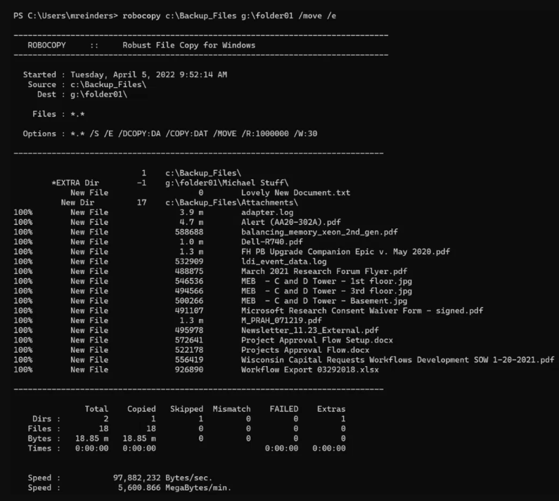

## Introduction

Robocopy, short for "Robust File Copy," is a highly efficient and reliable file copying utility that is included with Windows operating systems. It was first introduced with Windows NT 4.0 and has become an essential tool for IT professionals, system administrators, and power users. In this detailed guide, we will delve into the features, usage, and advantages of Robocopy, equipping you with the knowledge to utilize this powerful utility effectively.

## What is Robocopy?

Robocopy is a command-line utility designed for fast and robust file replication. It surpasses traditional copy commands with its ability to handle complex tasks such as resuming interrupted transfers, copying NTFS permissions, and performing multi-threaded operations. Robocopy is especially useful for large-scale file migrations, backups, and directory synchronizations.

## Key Features

1.	Resilient to Interruptions: Robocopy can resume copying after network interruptions or other disruptions. It retries the copy operation a specified number of times before quitting.
2.	Mirror Mode: Robocopy can mirror a complete directory tree, making the destination directory an exact copy of the source. This includes deleting files from the destination if they no longer exist in the source.
3.	Incremental Copy: It only copies files that have changed. This reduces the time required for copying large directory structures.
4.	Multithreading: Robocopy can copy files in parallel (multiple files at once), significantly improving the speed of the copy operation. This feature is enabled with the /MT switch.
5.	Logging: It provides extensive logging capabilities, allowing users to keep records of what was copied and any errors that occurred.
6.	File Attributes and NTFS Security: Robocopy can preserve file attributes, timestamps, and NTFS ACLs (Access Control Lists) during the copy operation.
7.	File Size and Path Length: Robocopy can handle very large files and path names longer than the traditional 255 characters.

## Basic Syntax

> `ROBOCOPY [source] [destination] [file(s)_to_copy] [options]`

- source: Specifies the path to the source directory.
- destination: Specifies the path to the destination directory.
- file(s)_to_copy: Specifies the files to be copied (wildcards can be used).
- options: Specifies options to control the copy behavior.

## Common Options

|Option|Description|
|:----|:----|
|/S|Copy subdirectories, but not empty ones.|
|/E|Copy all subdirectories, including empty ones.|
|/COPY:copyflags|Specify the file properties to copy (D=Data, A=Attributes, T=Timestamps, S=Security=NTFS ACLs, O=Owner info, U=Auditing info).|
|/DCOPY:T|Copy directory timestamps.|
|/PURGE|Delete destination files/directories that no longer exist in the source.|
|/MIR|Mirror a directory tree (equivalent to /E plus /PURGE).|
|/MOV|Move files (delete from source after copying).|
|/MOVE|Move files and directories (delete from source after copying).|
|/ETA|Show estimated time of arrival (ETA) for copied files.|
|/R:n|Number of retries on failed copies (default is 1 million).|
|/W:n|Wait time between retries in seconds (default is 30).|
|/LOG:file|Output log file.|
|/LOG+:file|Append to log file.|
|/MT[:n]|Multithreaded copying, n specifies the number of threads (default is 8, maximum is 128).|
|/XD dirs [dirs]|Exclude directories matching the specified names/paths.|
|/XF files [files]|Exclude files matching the specified names/paths.|

> ## Example Usage
>
> #### A. Basic Copy
> `ROBOCOPY C:\Source C:\Destination`
>
> #### B. Copy Subdirectories Including Empty Ones
> `ROBOCOPY C:\Source C:\Destination /E`
>
> #### C. Mirror Source to Destination
> `ROBOCOPY C:\Source C:\Destination /MIR`
>
> #### D. Move Files and Directories
> `ROBOCOPY C:\Source C:\Destination /MOVE`
>
> #### E. Multithreaded Copy with Logging
> `ROBOCOPY C:\Source C:\Destination /MT:16 /LOG:C:\LogFile.txt`

## Advanced Usage Scenarios

- **Backup and Restore**: Robocopy can be used for creating backups of important data. By using the /MIR switch, users can ensure that the backup is an exact replica of the source directory.
- **Scheduled Tasks**: Robocopy can be scheduled to run at specific times using the Windows Task Scheduler, making it useful for automated backup tasks.
- **Data Migration**: When moving data between servers or migrating to new hardware, Robocopy ensures that all file properties and permissions are retained.

> `robocopy "Source" "Destination" /E /R:5 /W:10 /log:c:\robocopy\log.txt`

## Conclusion

Robocopy is a powerful and versatile tool for file and directory replication in Windows environments. Its robust feature set makes it suitable for simple copy tasks as well as complex data migration and backup operations. By mastering its options and switches, users can leverage Robocopy to efficiently manage their file system tasks.

